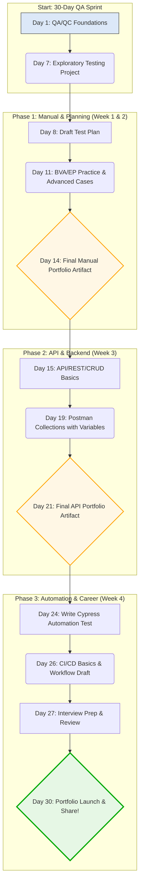

# 🧪 The QA-Universe **30-Day QA Learning Sprint**

**Goal:** Master the core disciplines of Software Quality Assurance (Manual, API, Automation) and build a **portfolio** ready for job applications.

> 💡 This is a **learning sprint**. Focus on understanding the _why_ and building portfolio-ready artifacts. Consistency is key!

---

## 🧭 Repository Structure (Your Workspace)

Your completed work for the Roadmap will live in these corresponding folders:

```
QA-Universe/
├── 📅 Roadmap.md                       # This file guides your path
├── 📖 Books_PDFs/                      # Theoretical resources
├── 📂 Tutorials/                       # Your personal notes and cheat sheets
├── 📂 Projects/                        # Your ongoing work and practice files
│   ├── Manual_Testing/                 # Test plans, cases, bug reports (Week 1-2)
│   ├── API_Testing/                    # Postman collections, API cases (Week 3)
│   └── Automation/                     # Selenium/Cypress projects (Week 4)
├── 📂 Practice_Sites/                  # Demo apps/APIs for hands-on practice
├── 📂 Interview_Preparation/           # Career prep and ISTQB samples
└── 📂 Final_Projects/                  # Showcase of your best completed work
```

---

## 📅 Week 1: QA Foundations & Manual Testing Essentials

**Focus:** **The QA Mindset.** Learn the lifecycle, methodologies, and the art of professional testing documentation.

| Day       | Topic                                            | Task/Deliverable                                                                       | Output Folder                                  |
| :-------- | :----------------------------------------------- | :------------------------------------------------------------------------------------- | :--------------------------------------------- |
| **Day 1** | Introduction to QA, Testing Principles           | Read **QA-Universe/README.md**. Define QA vs. QC.                                      | `Tutorials/Manual_Testing.md`                  |
| **Day 2** | SDLC, STLC, Agile/Scrum Basics                   | Summarize key phases (Requirements → Maintenance).                                     | `Tutorials/Manual_Testing.md`                  |
| **Day 3** | Types of Testing (Functional vs. Non-Functional) | Create a list of 10 common testing types (Smoke, Regression, etc.).                    | `Tutorials/Manual_Testing.md`                  |
| **Day 4** | **Test Scenarios**                               | Practice writing scenarios for **SauceDemo** login/checkout.                           | `Projects/Manual_Testing/TestScenarios.md`     |
| **Day 5** | **Test Case Structure**                          | Write 5 detailed, _executable_ test cases for the **SauceDemo** login.                 | `Projects/Manual_Testing/TestCases.xlsx`       |
| **Day 6** | Defect/Bug Life Cycle                            | Create a **Bug Report Template** and define all its fields.                            | `Projects/Manual_Testing/BugReportTemplate.md` |
| **Day 7** | **Exploratory Testing Project**                  | Spend 2 hours testing a `Practice_Site/`. Report **two bugs** using your new template. | `Projects/Manual_Testing/BugReports/`          |

---

## 📅 Week 2: Test Management, Strategy & Techniques

**Focus:** **Efficiency.** Move beyond execution to planning, reporting, and specialized techniques.

| Day        | Topic                                       | Task/Deliverable                                                                            | Output Folder                            |
| :--------- | :------------------------------------------ | :------------------------------------------------------------------------------------------ | :--------------------------------------- |
| **Day 8**  | **Test Plan Fundamentals**                  | Draft a **Test Plan** outline for the **OrangeHRM** site. (Scope, Strategy, Exit Criteria). | `Projects/Manual_Testing/TestPlan.md`    |
| **Day 9**  | **Jira** & Defect Tracking                  | Watch a Jira Crash Course. Define the **workflow** for a single bug (Open → Closed).        | `Tutorials/Manual_Testing.md`            |
| **Day 10** | Test Design Techniques                      | Study **Boundary Value Analysis (BVA)** and **Equivalence Partitioning (EP)**.              | `Tutorials/Manual_Testing.md`            |
| **Day 11** | **BVA & EP Practice**                       | Apply BVA and EP to the _password field_ on SauceDemo. Add 10 new cases to your file.       | `Projects/Manual_Testing/TestCases.xlsx` |
| **Day 12** | **Optional Track: Mobile Testing**          | Read `Mobile_Testing_Guide.md`. Research 5 key differences between Web and Mobile testing.  | `Tutorials/Mobile_Testing.md`            |
| **Day 13** | **ISTQB & Certifications**                  | Review the sample questions in `Interview_Preparation/`. Take a short practice quiz.        | `Interview_Preparation/Notes.md`         |
| **Day 14** | **Mini Project: Manual Portfolio Artifact** | Finalize your best **Test Plan** and **Bug Report** to move to `Final_Projects/`.           | `Final_Projects/Manual_Testing/`         |

---

## 📅 Week 3: API Testing & The Backend

**Focus:** **Data Integrity.** Learn to test the business logic and communication layer directly using Postman.

| Day        | Topic                                    | Task/Deliverable                                                                                | Output Folder                               |
| :--------- | :--------------------------------------- | :---------------------------------------------------------------------------------------------- | :------------------------------------------ |
| **Day 15** | API, REST, CRUD Basics                   | Define what an API is, and the use case for **GET, POST, PUT, DELETE**.                         | `Tutorials/API_Testing_Postman.md`          |
| **Day 16** | Postman Setup & UI                       | Install Postman. Successfully send your first **GET** request to `DummyJSON_API.md`.            | `Projects/API_Testing/Notes.md`             |
| **Day 17** | **Working with Collections**             | Create a Postman Collection for **Swagger Petstore**. Add one of each CRUD operation.           | `Projects/API_Testing/Postman_Collections/` |
| **Day 18** | **Adding Assertions**                    | Add `pm.test` assertions for status codes (200, 201) and response data schema.                  | _Update Postman Collection_                 |
| **Day 19** | **Using Variables**                      | Use environment/collection variables to pass an ID from a POST request to a GET request.        | _Update Postman Collection_                 |
| **Day 20** | **Optional Track: Performance Testing**  | Read `Performance_Testing_JMeter.md`. Define Load, Stress, and Soak testing.                    | `Tutorials/Performance_Testing.md`          |
| **Day 21** | **Mini Project: API Portfolio Artifact** | Export your fully validated **Postman Collection** (with tests/variables) to `Final_Projects/`. | `Final_Projects/API_Testing/`               |

---

## 📅 Week 4: Test Automation, CI/CD, & Career Prep

**Focus:** **Scalability.** Introduce automation frameworks and integrate them into the CI/CD pipeline.

| Day        | Topic                           | Task/Deliverable                                                                                              | Output Folder                         |
| :--------- | :------------------------------ | :------------------------------------------------------------------------------------------------------------ | :------------------------------------ |
| **Day 22** | Automation Principles & Pyramid | Understand the Test Automation Pyramid (Unit, Integration, E2E).                                              | `Tutorials/Selenium_Guide.md`         |
| **Day 23** | **Cypress Basics**              | Set up a local Cypress project. Run the default example tests.                                                | `Projects/Automation/Cypress/`        |
| **Day 24** | **Cypress Test Writing**        | Write a complete **Login Test** (`login_test.cy.js`) for SauceDemo using Cypress.                             | `Projects/Automation/Cypress/`        |
| **Day 25** | Selenium Basics                 | Read `Selenium_Guide.md`. Identify the key locators (ID, XPath, CSS Selectors).                               | `Tutorials/Selenium_Guide.md`         |
| **Day 26** | **Optional Track: CI/CD**       | Read `CI-CD_Guide.md`. Draft a simple **GitHub Actions** workflow for running your Cypress test.              | `Projects/CI-CD/cypress_ci.yml`       |
| **Day 27** | **Interview Prep**              | Review Top 20 QA Interview Questions in `Interview_Preparation/`. Write out your answers to the first 5.      | `Interview_Preparation/My_Answers.md` |
| **Day 28** | **Automation Refinement**       | Clean up and document your Cypress/Selenium code. Ensure it runs cleanly.                                     | `Projects/Automation/`                |
| **Day 29** | **Final Portfolio Review**      | Review all artifacts in your `Final_Projects/` folder. Ensure everything is correctly formatted and complete. | _Review `Final_Projects/`_            |
| **Day 30** | **LAUNCH DAY!**                 | Upload your latest work to GitHub. **Share your profile/repo on LinkedIn** or a QA community group!           | `Final_Projects/` (Last Push)         |

---

## 🎯 Your Final Deliverables (The Portfolio)

By completing this sprint, you will have a comprehensive portfolio showcasing all major QA skills:

| Skill Area           | Deliverable Artifact                                                                   | Location                              |
| :------------------- | :------------------------------------------------------------------------------------- | :------------------------------------ |
| **Manual Testing**   | A complete **Test Plan** and a professional **Bug Report**.                            | `Final_Projects/Manual_Testing/`      |
| **API Testing**      | A Postman Collection with variables, pre-request scripts, and multiple **assertions**. | `Final_Projects/API_Testing/`         |
| **Web Automation**   | Clean, working **Cypress** or **Selenium** test script for a real application.         | `Final_Projects/Automation/`          |
| **Career Readiness** | Notes and prepared answers for common **QA Interview Questions**.                      | `Interview_Preparation/My_Answers.md` |

---

## 🧠 Visual Mindmap (Optional)

Create your own visual mindmap to connect these concepts and link the image here!



👉 Suggested tools to build the roadmap as a mindmap:

- [Excalidraw](https://excalidraw.com/)
- [MindMeister](https://www.mindmeister.com/)
- [Whimsical](https://whimsical.com/)

---

<sub>Built for learners & contributors. Use this roadmap, upload your work, and grow your QA career 🚀</sub>

```

```

### About the QA

## Jubair Rahman

**Software Engineer (QA) | HealthTech | Passionate about testing, tools, and UI quality.**

[](https://www.linkedin.com/in/jubair-rahman/) [](https://github.com/JubairRahman) [](https://wa.me/8801645763353)

```

```
