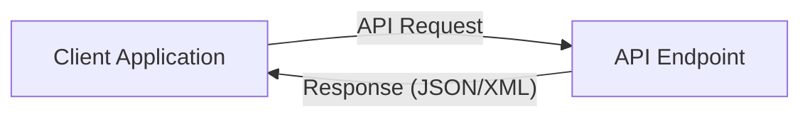
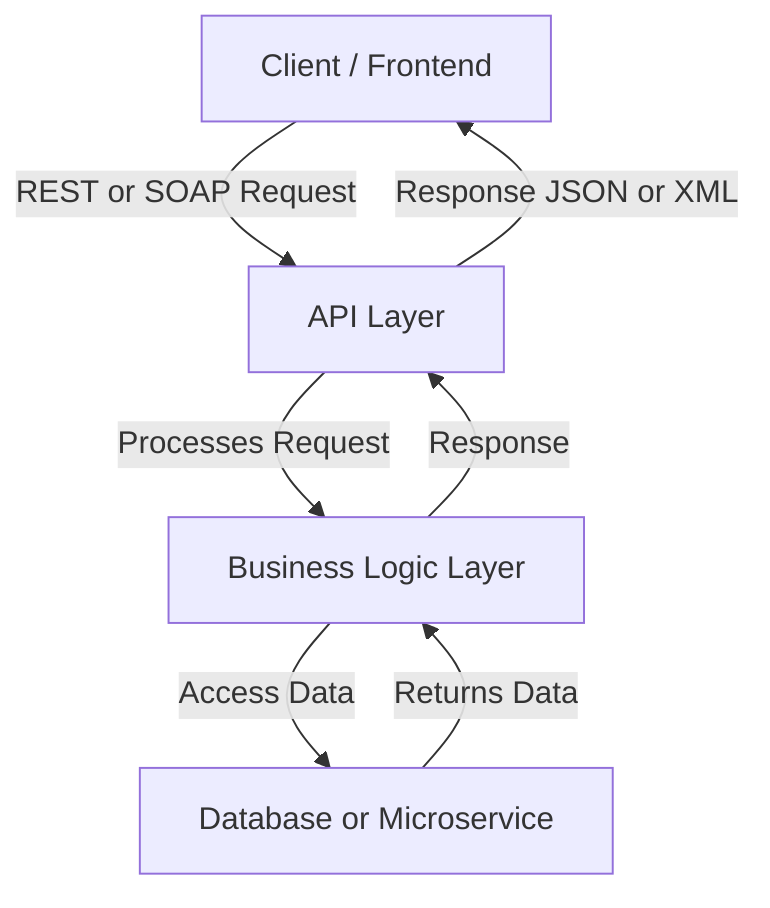
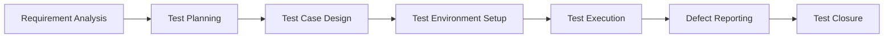
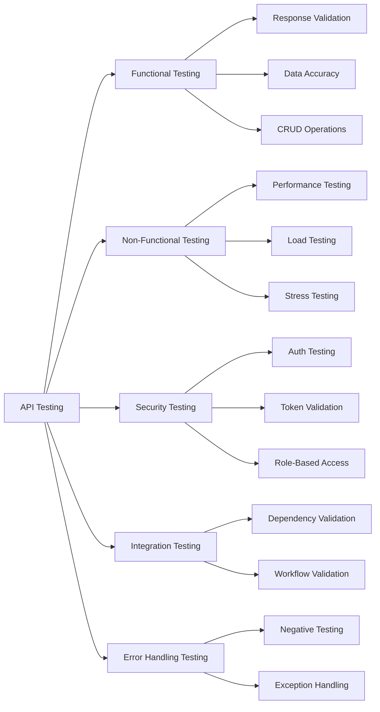
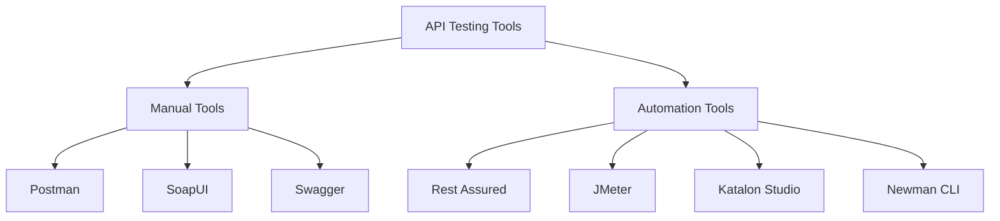
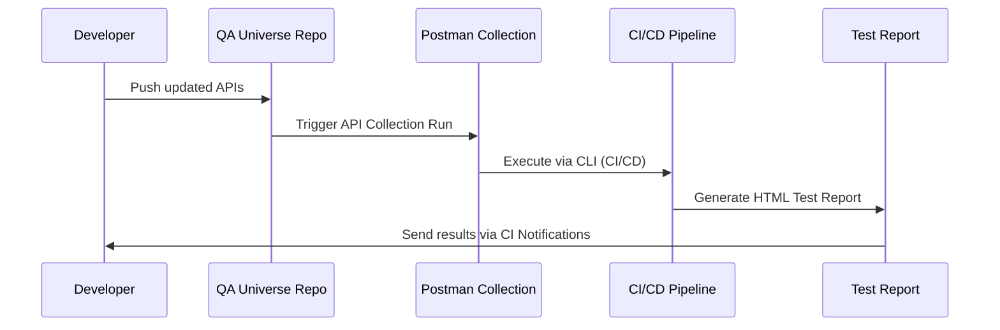

# 🌐 API Testing – Comprehensive Guide

## 1. Introduction

**API Testing** is a type of software testing that focuses on verifying the **Application Programming Interfaces (APIs)** directly.  
It ensures that all system components **communicate correctly**, exchange data reliably, and meet business and performance expectations.

---

## 2. What is an API?

**API (Application Programming Interface)** acts as a bridge between two software applications, enabling them to communicate.  
It defines methods and data formats used to request and exchange information.

#### Example:

##### Frontend (Web/Mobile App) → sends a request → API → Backend → Database → returns result to UI.

## 3. Why API Testing?

| Purpose                    | Description                                             |
| -------------------------- | ------------------------------------------------------- |
| **Early defect detection** | API testing can begin before UI is developed.           |
| **Faster execution**       | APIs are lighter and faster to test than UI.            |
| **Improved reliability**   | Ensures stable communication between components.        |
| **Better coverage**        | Test business logic, performance, and security at once. |
| **CI/CD integration**      | Supports automation pipelines for continuous testing.   |

## 4. API Testing Architecture Overview

This shows how data flows through different layers during API testing.

## 5. API Testing Life Cycle (Process)

| Phase                      | Description                                                           | Output                 |
| -------------------------- | --------------------------------------------------------------------- | ---------------------- |
| **Requirement Analysis**   | Understand API specifications, endpoints, request/response structure. | API Documentation, RTM |
| **Test Planning**          | Define objectives, scope, tools, and resources.                       | Test Plan              |
| **Test Case Design**       | Create test cases for each API endpoint and data scenario.            | Test Cases, Test Data  |
| **Test Environment Setup** | Configure environment and tools (e.g., Postman, Swagger).             | Environment Ready      |
| **Test Execution**         | Run test cases manually or automatically.                             | Test Results           |
| **Defect Reporting**       | Log and track API defects.                                            | Defect Reports         |
| **Test Closure**           | Finalize reports, lessons learned, metrics.                           | Test Summary Report    |

## 6. Types of API Testing

| Category           | Example Tests                             | Purpose                              |
| ------------------ | ----------------------------------------- | ------------------------------------ |
| **Functional**     | GET, POST, PUT, DELETE endpoints          | Validate business logic and data     |
| **Non-Functional** | Load, Performance, Scalability            | Check response time, throughput      |
| **Security**       | Authentication, Authorization, Encryption | Ensure secure data access            |
| **Integration**    | Multi-service API chaining                | Validate inter-service communication |
| **Error Handling** | Invalid inputs, broken payloads           | Test API robustness                  |

## 7. Common API Methods

| HTTP Method | Operation      | Description              | Example          |
| ----------- | -------------- | ------------------------ | ---------------- |
| **GET**     | Retrieve       | Fetches data from server | `/api/users`     |
| **POST**    | Create         | Adds a new record        | `/api/users`     |
| **PUT**     | Update         | Updates an entire record | `/api/users/101` |
| **PATCH**   | Partial Update | Updates specific fields  | `/api/users/101` |
| **DELETE**  | Remove         | Deletes a record         | `/api/users/101` |

## 8. API Testing Tools

| Tool                  | Category            | Description                            |
| --------------------- | ------------------- | -------------------------------------- |
| **Postman**           | Manual / Automation | Design, test, and automate REST APIs   |
| **SoapUI**            | Manual / Automation | Ideal for SOAP and REST testing        |
| **Swagger / OpenAPI** | Manual              | API design, documentation, and testing |
| **Rest Assured**      | Automation          | Java-based API automation framework    |
| **JMeter**            | Automation / Load   | Performance and stress testing         |
| **Katalon Studio**    | Automation          | Supports API + Web + Mobile testing    |
| **Newman**            | CLI Automation      | Run Postman collections in CI/CD       |

## 9. API Test Case Examples

| Test ID | Scenario            | Method | Input / Endpoint | Expected Result              |
| ------- | ------------------- | ------ | ---------------- | ---------------------------- |
| API_001 | Verify valid login  | POST   | `/api/login`     | `200 OK`, returns auth token |
| API_002 | Invalid credentials | POST   | `/api/login`     | `401 Unauthorized`           |
| API_003 | Fetch user list     | GET    | `/api/users`     | JSON array, `200 OK`         |
| API_004 | Add a new user      | POST   | `/api/users`     | `201 Created`                |
| API_005 | Update user details | PUT    | `/api/users/101` | `200 OK`, data updated       |
| API_006 | Delete user         | DELETE | `/api/users/101` | `204 No Content`             |
| API_007 | Performance check   | GET    | `/api/users`     | Response time < 200 ms       |

## 10. API Validation Checklist

| Validation Type    | Example                          | Description                               |
| ------------------ | -------------------------------- | ----------------------------------------- |
| **Response Code**  | `200 OK`, `400 Bad Request`      | Validate expected status codes            |
| **Response Time**  | < 200 ms                         | Check performance threshold               |
| **Response Body**  | Matches JSON schema              | Validate field names, types               |
| **Headers**        | `Content-Type: application/json` | Ensure correct content and cache settings |
| **Authentication** | JWT, OAuth tokens                | Check authorization and session handling  |
| **Error Handling** | Proper error messages            | Ensure user-friendly error responses      |

## 11. API Automation Flow (Example)

## 12. Best Practices for API Testing

- Always validate both positive and negative scenarios
- Use environment variables for URLs, tokens, and test data
- Test boundary values and invalid inputs
- Automate repetitive and regression API tests
- Integrate API tests into CI/CD pipelines
- Verify data integrity in both request and response
- Use mock servers for unavailable APIs during early testing

## 13. Conclusion

API Testing ensures the core communication between systems works flawlessly.
It validates functionality, performance, reliability, and security — the backbone of modern software systems.

> 💡 Remember: A system’s stability doesn’t come from its UI, but from its APIs.
