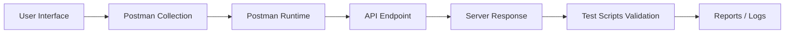
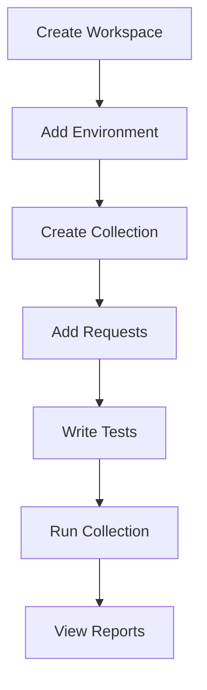
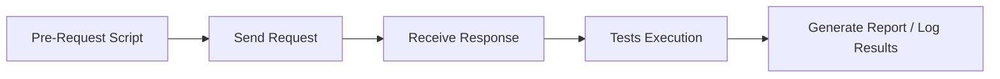
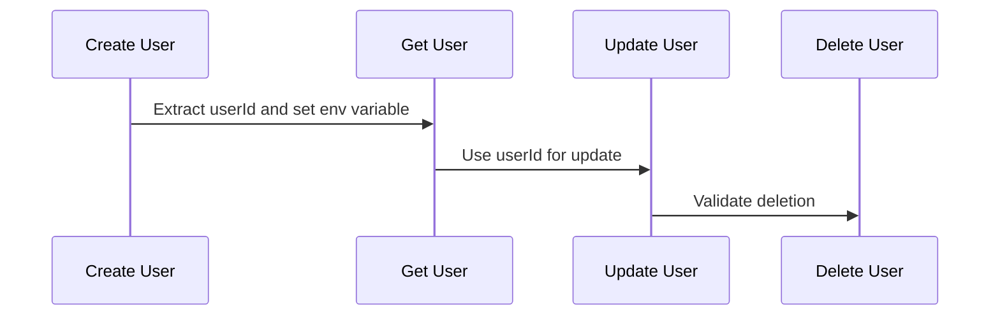
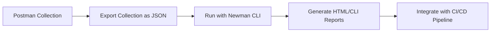
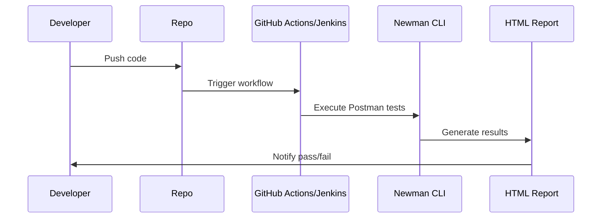
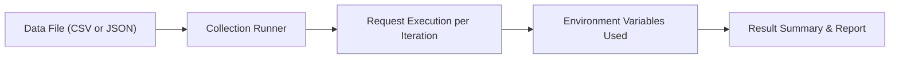
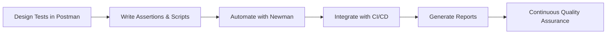

# 🚀 Postman – API Testing & Automation Guide

## 1. What is Postman?

**Postman** is a powerful platform for **API development, testing, and automation**.  
It allows QA engineers and developers to:

- Create and send API requests
- Validate responses
- Automate test suites
- Integrate with CI/CD pipelines
- Generate test reports

Postman supports REST, SOAP, and GraphQL APIs, making it an essential tool for every QA workflow.

---

## 2. Key Features of Postman

| Feature                 | Description                                                            |
| ----------------------- | ---------------------------------------------------------------------- |
| **Collections**         | Group multiple API requests into logical folders.                      |
| **Environments**        | Store variables such as URLs, tokens, and credentials for reusability. |
| **Pre-Request Scripts** | Add JavaScript code to run before API requests.                        |
| **Tests (Assertions)**  | Automate response validation using scripts.                            |
| **Newman**              | Command-line runner for executing Postman collections.                 |
| **Monitors**            | Schedule and run tests automatically at intervals.                     |
| **Team Workspaces**     | Collaborate and share API collections within your team.                |

---

## 3. Postman Architecture Overview



## 4. Postman Installation Guide

### 🖥️ For Windows

1. Go to the official website: https://www.postman.com/downloads/
2. Download the **Windows 64-bit** installer.
3. Run the `.exe` file and follow the installation wizard.
4. Launch Postman and sign in or create a free account.

## 🍏 For macOS

1. Download the macOS version from the same official website: https://www.postman.com/downloads/
2. Open the `.zip` file and drag Postman.app to your Applications folder.
3. Start Postman from the Launchpad.

## 🐧 For Linux (Ubuntu / Fedora / Debian)

### Using Snap (Recommended)

```bash
sudo snap install postman
```

### Using Tarball

1. Download the `tar.gz` from the official site.
2. Extract the file:

```bash
tar -xvf Postman-linux-x64.tar.gz
```

3. Move it to `/opt`:

```bash
sudo mv Postman /opt/
```

4. Create a symbolic link:

```bash
sudo ln -s /opt/Postman/Postman /usr/bin/postman
```

5. Launch with:

```bash
postman
```

## Postman Workspace Setup



| Step                     | Description                                           |
| ------------------------ | ----------------------------------------------------- |
| **1. Create Workspace**  | Organize your APIs into projects (Team or Personal).  |
| **2. Add Environment**   | Define variables like `base_url`, `token`, `user_id`. |
| **3. Create Collection** | Group related API endpoints together.                 |
| **4. Add Requests**      | Configure each endpoint (GET, POST, PUT, DELETE).     |
| **5. Write Tests**       | Add JavaScript assertions to validate responses.      |
| **6. Run Collection**    | Execute all tests in sequence.                        |
| **7. Analyze Results**   | Review passed/failed requests and debug.              |

## ✍️ 6. Writing Test Scripts in Postman

Postman allows you to write **JavaScript-based test scripts** to validate API responses, manage data dynamically, and automate test workflows.  
These scripts run **after a request is sent**, and they can verify API behavior, extract values, or trigger conditional logic for the next requests.

### Script Execution Flow



### Script Tabs in Postman

| Tab                    | Purpose                         | Example Use                                                       |
| ---------------------- | ------------------------------- | ----------------------------------------------------------------- |
| **Pre-request Script** | Runs before the request is sent | Generating tokens, timestamps, or random data                     |
| **Tests**              | Runs after receiving a response | Checking status codes, validating response body, saving variables |

### Basic Test Script Structure

```javascript
pm.test("Status code is 200", function () {
  pm.response.to.have.status(200);
});
```

You can include multiple tests in one request; Postman will show each test result separately.

### Common Assertions in Postman

| Assertion              | Example                                                           | Description             |
| ---------------------- | ----------------------------------------------------------------- | ----------------------- |
| **Status Code**        | `pm.response.to.have.status(200);`                                | Checks HTTP status      |
| **Response Time**      | `pm.expect(pm.response.responseTime).to.be.below(500);`           | Checks performance      |
| **Header Validation**  | `pm.response.to.have.header("Content-Type", "application/json");` | Validates headers       |
| **Body Contains Text** | `pm.expect(pm.response.text()).to.include("success");`            | Checks body content     |
| **JSON Field Exists**  | `pm.expect(jsonData).to.have.property("id");`                     | Checks JSON property    |
| **Value Comparison**   | `pm.expect(jsonData.id).to.eql(101);`                             | Validates data equality |

### Working with Variables

```javascript
// Get and set variables
let baseUrl = pm.environment.get("base_url");
pm.environment.set("authToken", "abcdef12345");
```

> Best practice: Store dynamic values like tokens and IDs in environment or collection variables for reuse.

### Chaining Requests (Dynamic Data Passing)

#### Extract Token from Login API

```javascript
let jsonData = pm.response.json();
pm.environment.set("authToken", jsonData.token);
```

#### Use Token in Headers

```css
Authorization: Bearer {{authToken}}
```

### Validating JSON Response Body

```javascript
let jsonData = pm.response.json();

pm.test("User object structure is correct", function () {
  pm.expect(jsonData).to.have.all.keys("id", "name", "email", "status");
});
```

### Schema Validation (JSON Schema)

```javascript
const schema = {
  type: "object",
  properties: {
    id: { type: "number" },
    name: { type: "string" },
    email: { type: "string" },
  },
  required: ["id", "name", "email"],
};

pm.test("Response matches schema", function () {
  pm.response.to.have.jsonSchema(schema);
});
```

### Data-Driven Testing Example

You can run the same request with multiple data rows using CSV/JSON datasets.

**CSV Example**

```csv
name,email
John,john@example.com
Jane,jane@example.com
```

**Command**

```bash
newman run CreateUserCollection.json -d users.csv
```

### Conditional Testing

```javascript
if (pm.response.code === 200) {
  console.log("Success!");
} else {
  console.warn("Unexpected response code");
}
```

### Error Handling

```javascript
try {
  let jsonData = pm.response.json();
  pm.test("Contains ID", function () {
    pm.expect(jsonData).to.have.property("id");
  });
} catch (e) {
  console.error("Parsing failed:", e);
}
```

### API Reference (pm.\*)

| Function                       | Description           | Example                                 |
| ------------------------------ | --------------------- | --------------------------------------- |
| `pm.response.json()`           | Parse JSON body       | `let data = pm.response.json();`        |
| `pm.expect()`                  | Assertion syntax      | `pm.expect(value).to.eql(10);`          |
| `pm.environment.set()`         | Set variable          | `pm.environment.set("token", "abc");`   |
| `pm.collectionVariables.get()` | Get variable          | `pm.collectionVariables.get("userId");` |
| `pm.iterationData.get()`       | Data-driven parameter | `pm.iterationData.get("email");`        |

### End-to-End Example (Chained APIs)



```javascript
// Create user
let data = pm.response.json();
pm.environment.set("userId", data.id);

// Get user
pm.test("Verify user details", function () {
  let res = pm.response.json();
  pm.expect(res.id).to.eql(pm.environment.get("userId"));
});
```

### Debugging with Postman Console

```javascript
console.log("Response:", pm.response.json());
console.warn("Potential issue detected");
console.error("Critical API failure");
```

### Best Practices for Postman Test Scripts

- Keep test names descriptive
- Validate both status codes and response bodies
- Use environments for URLs, tokens, and credentials
- Include positive & negative test cases
- Use JSON schema validation
- Log meaningful messages to console
- Store data dynamically between requests
- Avoid hardcoding values

### Automating API Suites Using Postman + Newman

Once your test scripts are ready, automate them with Newman, Postman’s CLI runner.

#### Postman to Newman Workflow



#### What is Newman?

**Newman** is a command-line tool that allows you to run Postman collections directly from your terminal or CI/CD pipelines.

#### Installation

```bash
npm install -g newman
```

**Check version:**

```bash
newman -v
```

#### Running Collections

```bash
newman run api_collection.json
```

**With environment:**

```bash
newman run api_collection.json -e staging_env.json
```

**With data file:**

```bash
newman run api_collection.json -e staging_env.json -d data.csv
```

**Generate HTML report:**

```bash
newman run api_collection.json -r cli,html --reporter-html-export report.html
```

#### Integrating Newman with CI/CD



**GitHub Actions Example**

```yaml
name: Run API Tests

on:
  push:
    branches: [main]

jobs:
  test:
    runs-on: ubuntu-latest
    steps:
      - uses: actions/checkout@v3
      - name: Install Newman
        run: npm install -g newman
      - name: Run Postman Tests
        run: newman run tests/api/postman_collections/user_collection.json -r cli,html --reporter-html-export tests/api/reports/newman-report.html
```

## 8. Reporting and Test Results

After executing collections, **Newman** provides detailed **CLI** and **HTML** reports.

**CLI Report**

```bash
→ GET /users
  ✓  Status code is 200
  ✓  Response contains userId
  ✓  Response time < 500ms
```

**HTML Report Example**

- Summary of Passed/Failed tests
- Average Response Time
- Error stack trace for failed assertions
- Environment and data iteration logs

## 9. Data-Driven and Environment Testing



**Example Command**

```bash
newman run CreateUserCollection.json -e staging.json -d users.csv
```

> Enables automated regression testing with multiple data inputs.

## 10. Best Practices for Postman Automation

| Category              | Best Practice                                           |
| --------------------- | ------------------------------------------------------- |
| **Variables**         | Use environments for base URLs, tokens, and credentials |
| **Assertions**        | Always validate status, body, and response time         |
| **Collections**       | Keep logically grouped per feature or service           |
| **Chaining**          | Extract and reuse data dynamically                      |
| **Schema Validation** | Enforce consistent API structure                        |
| **Data-Driven Tests** | Use CSV/JSON for dynamic iteration                      |
| **Error Handling**    | Wrap scripts with `try...catch`                         |
| **Version Control**   | Commit collections and environments to GitHub           |
| **Automation**        | Schedule runs via CI/CD or Postman Monitors             |
| **Reporting**         | Generate HTML or JUnit reports for team visibility      |

## 11. Conclusion

Postman and Newman together create a **powerful**, **automated**, and **scalable API testing framework**.

**Postman** provides a rich GUI to design, test, and validate APIs,
while **Newman** extends it into automation pipelines for continuous testing and integration.

> 💡 In summary:
>
> - Use Postman Collections for test design
> - Use Test Scripts for validation logic
> - Use Newman for command-line execution and CI/CD
> - Use Data Files for bulk testing
> - Use Reports for tracking test health and API quality

Together, they form a complete API testing lifecycle for your QA Universe repository.


