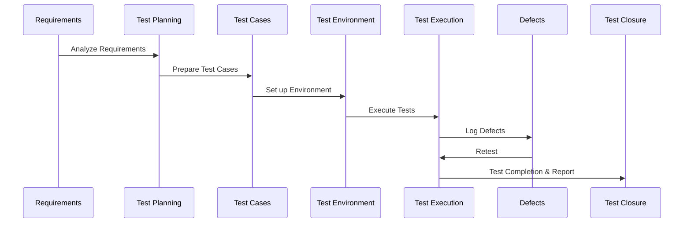

# SDLC and STLC

## 1. Software Development Life Cycle (SDLC)

**Definition:**  
The Software Development Life Cycle (SDLC) is a systematic process used to design, develop, test, and deploy high-quality software efficiently. SDLC provides a structured approach for managing software projects, ensuring the final product meets the requirements and expectations.

### **Phases of SDLC**

| Phase | Description |
|-------|-------------|
| **Requirement Analysis** | Gather and analyze business requirements from stakeholders. Document functional and non-functional requirements. |
| **Feasibility Study** | Assess technical, operational, and economic feasibility of the project. |
| **System Design** | Design system architecture, data models, and interface design based on requirements. |
| **Implementation / Coding** | Developers write code according to the design specifications. |
| **Testing** | Validate the software against requirements to identify and fix defects. |
| **Deployment** | Release the software to the production environment. |
| **Maintenance** | Provide ongoing support, bug fixes, and updates after deployment. |

### **SDLC Models**
- **Waterfall Model:** Sequential phase-wise development. Simple but less flexible.  
- **V-Model:** Extension of waterfall emphasizing testing at each development stage.  
- **Iterative Model:** Develop in small cycles, improving the system incrementally.  
- **Agile Model:** Collaborative and iterative approach focusing on customer feedback.  
- **Spiral Model:** Combines iterative development with risk analysis at each iteration.  

---

## 2. Software Testing Life Cycle (STLC)

**Definition:**  
The Software Testing Life Cycle (STLC) defines the testing process to ensure the quality of software through systematic planning, preparation, execution, and reporting of tests.

### **Phases of STLC**

| Phase | Description |
|-------|-------------|
| **Requirement Analysis** | Review and analyze requirements from a testing perspective. Identify testable requirements. |
| **Test Planning** | Define the testing strategy, scope, resources, timelines, and deliverables. Prepare test effort estimation. |
| **Test Case Development** | Write detailed test cases, test scripts, and prepare test data for execution. |
| **Test Environment Setup** | Prepare hardware, software, network, and other tools required for testing. |
| **Test Execution** | Execute test cases, log defects, and track results against expected outcomes. |
| **Defect Reporting & Tracking** | Report bugs in a defect tracking tool and collaborate with developers for resolution. |
| **Test Closure** | Evaluate test completion criteria, prepare test summary reports, and document lessons learned. |

---

## 3. Phase Details

| Phase                           | Activities                                                                                                                     | Deliverables                          |
| ------------------------------- | ------------------------------------------------------------------------------------------------------------------------------ | ------------------------------------- |
| **Requirement Analysis**        | Review requirements from a testing perspective, identify testable requirements, prepare RTM (Requirements Traceability Matrix) | RTM, Gap Analysis                     |
| **Test Planning**               | Define testing strategy, scope, resources, timelines, testing tools                                                            | Test Plan Document, Effort Estimation |
| **Test Case Development**       | Write test cases, scripts, prepare test data                                                                                   | Test Cases, Test Scripts, Test Data   |
| **Test Environment Setup**      | Configure hardware, software, network, and tools required for testing                                                          | Test Environment Ready                |
| **Test Execution**              | Execute test cases, log defects, verify fixes                                                                                  | Test Execution Reports, Defect Logs   |
| **Defect Reporting & Tracking** | Track defects, retest resolved defects, communicate status                                                                     | Defect Reports, Retest Results        |
| **Test Closure**                | Evaluate testing completion, prepare test summary report, lessons learned                                                      | Test Summary Report, Sign-offs        |

---

## 4. 7 Principles of Software Testing

- Testing shows presence of defects – Testing can show defects but cannot prove absence.
- Exhaustive testing is impossible – Not all combinations of inputs and paths can be tested.
- Early testing – Start testing activities as early as possible in SDLC.
- Defect clustering – Most defects are found in a few modules.
- Pesticide paradox – Repeating same tests will not find new defects; tests must evolve.
- Testing is context-dependent – Testing depends on the type of application.
- Absence-of-errors fallacy – A system can be defect-free but still fail to meet user needs.

## 5. Testng Methodologies

| Methodology            | Description                                                       |
| ---------------------- | ----------------------------------------------------------------- |
| **Manual Testing**     | Testers manually execute test cases without automation.           |
| **Automation Testing** | Tools/scripts are used to execute test cases automatically.       |
| **Black Box Testing**  | Focuses on functional requirements without knowing internal code. |
| **White Box Testing**  | Focuses on internal logic, structure, and code coverage.          |
| **Grey Box Testing**   | Combination of black box and white box techniques.                |
---

## 6. Types of Software Testing 

| Category | Testing Type | Description |
|----------|-------------|-------------|
| **Functional Testing** | Unit Testing | Test individual components or modules of the software. |
| | Integration Testing | Verify interaction between multiple modules or components. |
| | System Testing | Validate the complete and integrated system against requirements. |
| | User Acceptance Testing (UAT) | Ensure the system meets business requirements and user needs. |
| **Non-Functional Testing** | Performance Testing | Evaluate software performance under expected workload. |
| | Load Testing | Test system behavior under specific expected load conditions. |
| | Stress Testing | Determine software stability under extreme conditions or stress. |
| | Security Testing | Identify vulnerabilities and ensure data protection. |
| | Usability Testing | Assess how user-friendly and intuitive the application is. |
| **Other Testing Types** | Regression Testing | Verify that recent changes haven’t broken existing functionality. |
| | Smoke Testing | Initial testing to check basic functionality before detailed testing. |
| | Sanity Testing | Verify specific functionality after minor changes or bug fixes. |
| | Compatibility Testing | Check software compatibility with different devices, browsers, OS. |
| | Exploratory Testing | Ad-hoc testing to explore unknown issues or defects. |
---

### **STLC Artifacts**
- Test Plan Document (TPD)  
- Test Cases and Test Scripts  
- Test Data  
- Defect Reports  
- Test Summary Report  

## Key Differences between SDLC and STLC

| Aspect | SDLC | STLC |
|--------|------|------|
| **Focus** | Software development process | Software testing process |
| **Objective** | Deliver functional software | Ensure software quality and defect-free release |
| **Start Point** | Requirement gathering | After requirement analysis (testing perspective) |
| **End Point** | Software deployment & maintenance | Test closure & reporting |
| **Involvement** | Developers, analysts, architects | Testers, QA engineers |

---

## Conclusion

- **SDLC** ensures systematic development of software with proper planning, design, and deployment.  
- **STLC** ensures that the developed software meets quality standards by validating requirements through testing.  
- Together, SDLC and STLC ensure delivery of high-quality software that satisfies business needs and customer expectations.
